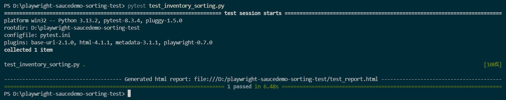
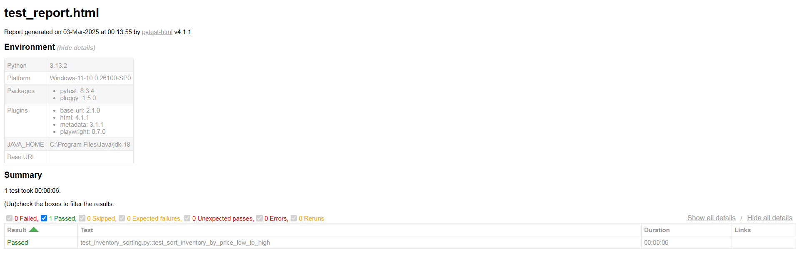
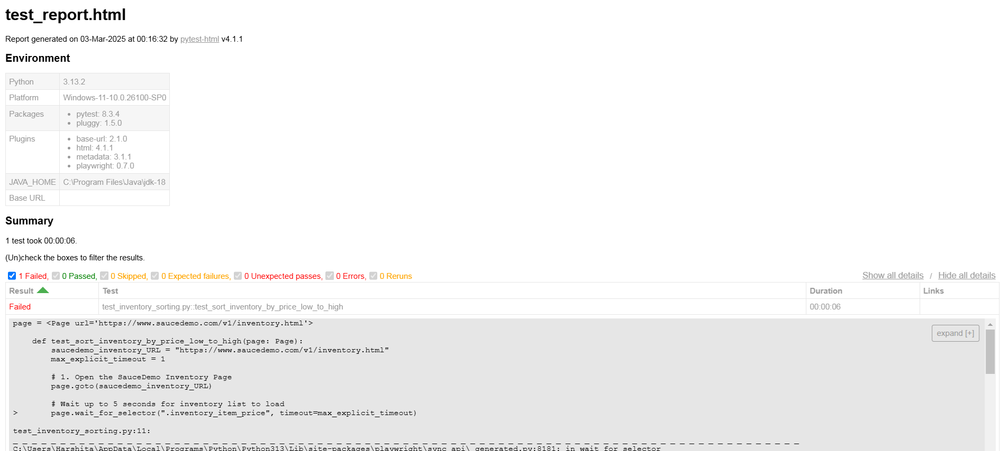

# 🛠️ Playwright SauceDemo Sorting Test  

  
Automated UI testing using **Playwright with Python** to verify the **Price (Low to High)** sorting functionality on the **SauceDemo Inventory Page**.  

---

## 📌 Features  

✅ **Automated Browser Testing** with Playwright  
✅ **Sorting Validation** - Ensures items are sorted from lowest to highest price  
✅ **Pytest Fixtures** - Structured test execution  
✅ **Screenshots & Video Recording** on failures  
✅ **HTML Test Reports**  

---

## 📂 Project Structure  

```
📦 playwright-saucedemo-sorting-test
│-- 📜 test_inventory_sorting.py   # Main test script
│-- 📜 pytest.ini                   # Pytest configuration file
│-- 📜 conftest.py                   # Fixtures for browser setup
│-- 📂 test_report/                   # Stores screenshots & videos
│   ├── screenshots/
│   ├── videos/
│-- 📜 README.md                     # Project documentation
```

---

## 🚀 Setup & Installation  

1️⃣ **Clone the Repository**  
```bash
git clone https://github.com/yourusername/playwright-saucedemo-sorting-test.git
cd playwright-saucedemo-sorting-test
```

2️⃣ **Install Dependencies**  
```bash
pip install pytest pytest-playwright
playwright install
```

3️⃣ **Run the Test**  
```bash
pytest test_inventory_sorting.py
```

---

## 📊 Test Execution  

### **Sorting Validation in Action**  
1️⃣ **Successful Test Execution**  
  

2️⃣ **Successful Test Report**  
  

3️⃣ **Failed Test Report**  
  

---

## 🛠️ Configuration  

The test settings are managed in **pytest.ini**:
```ini
[pytest]
addopts = --browser=chromium --headed --slowmo=1000 --screenshot=on --video=on --html=test_report.html --self-contained-html
```
- `--headed`: Runs the test in visible mode  
- `--slowmo=1000`: Adds delay for better visibility  
- `--screenshot=on`: Captures screenshots on failure  
- `--video=on`: Records video of test execution  
- `--html=test_report.html`: Generates an HTML report  

---

## 📌 Expected Outcome  

✔️ The test should:  
🔹 Load the inventory page  
🔹 Select **"Price (Low to High)"** from the dropdown  
🔹 Verify that prices are sorted in ascending order  
🔹 Capture screenshots and generate an HTML report  

### 📧 Connect with Me  

💼 **GitHub**: [malusareharshita24](https://github.com/malusareharshita24)  
📩 **Email**: malusareharshu1409@gmail.com

Happy Testing! 🚀🎯  
